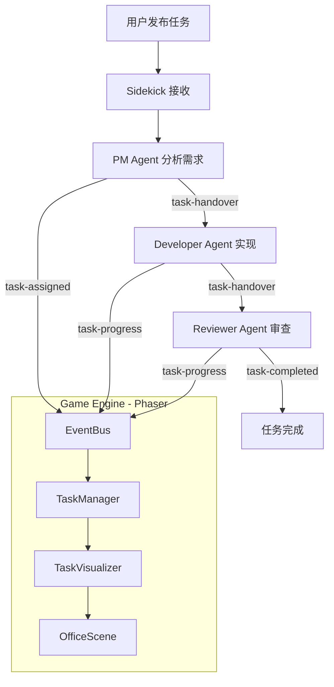
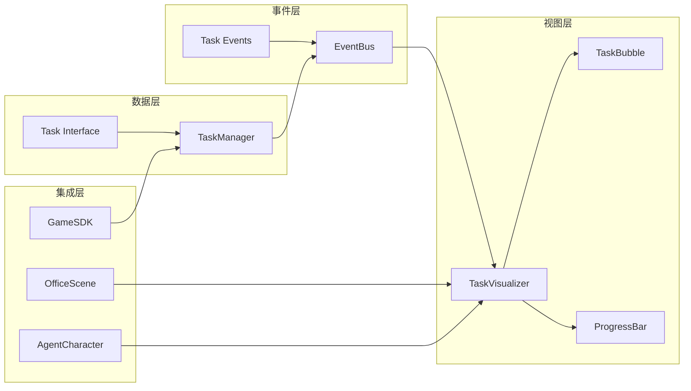
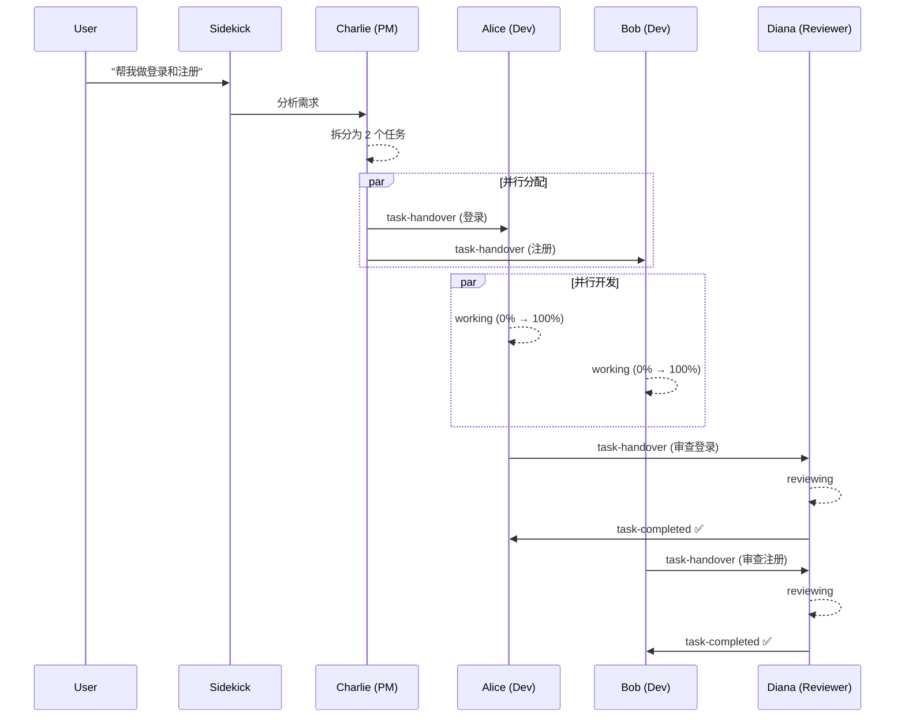
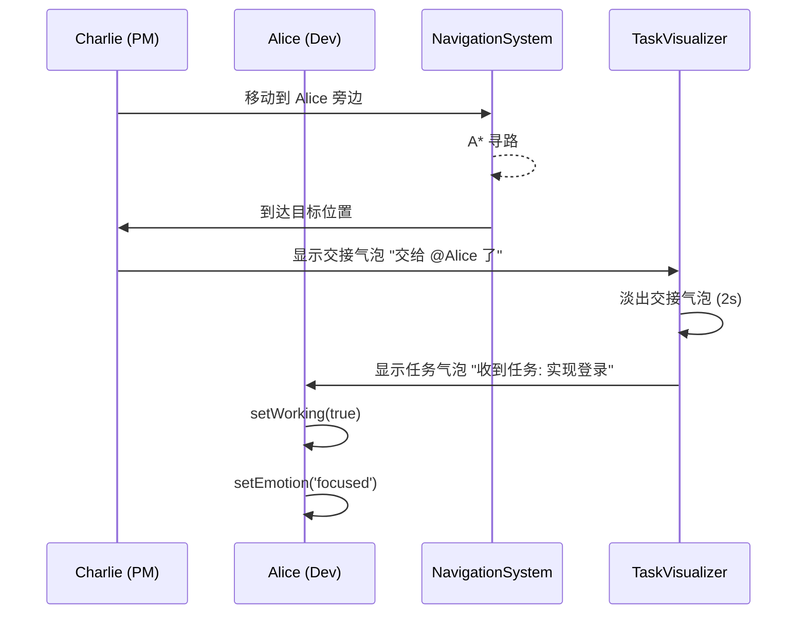

# Task Visualization System - 技术设计文档

> 版本: 1.0 | 创建时间: 2026-04-03 | 状态: Draft

---

## 1. 架构概览

### 1.1 系统上下文



### 1.2 模块依赖关系



---

## 2. 数据结构设计

### 2.1 Task 接口

```typescript
interface Task {
  id: string;
  agentId: string;                    // 'alice' | 'bob' | 'charlie' | 'diana'
  description: string;                // 任务描述
  status: TaskStatus;                 // 当前状态
  progress: number;                   // 0-100
  currentAction: string;              // 当前操作描述，如 "编写代码中..."
  taskType: TaskType;                 // 'coding' | 'testing' | 'review' | 'meeting'
  assignedAt: number;                 // 分配时间戳
  completedAt: number | null;         // 完成时间戳
  parentTaskId: string | null;        // 父任务 ID（支持子任务）
  metadata?: TaskMetadata;            // 扩展元数据
}

type TaskStatus = 'pending' | 'assigned' | 'working' | 'reviewing' | 'completed' | 'failed';

interface TaskMetadata {
  files?: string[];                   // 涉及的文件
  estimatedDuration?: number;         // 预计时长 ms
  priority?: 'low' | 'medium' | 'high';
  dependencies?: string[];            // 依赖的任务 ID
}
```

### 2.2 TaskManager 类

```typescript
class TaskManager {
  private activeTasks: Map<string, Task>;        // agentId -> Task（一个 agent 一个当前任务）
  private taskHistory: Map<string, Task>;        // taskId -> Task（已完成任务）
  private taskQueue: Task[];                     // 等待分配的任务队列
  private eventBus: EventBus;
  private maxHistorySize: number;

  constructor(eventBus: EventBus, config?: { maxHistorySize?: number });

  // 任务生命周期
  assignTask(agentId: string, task: Task): void;
  updateProgress(agentId: string, progress: number, currentAction?: string): void;
  completeTask(agentId: string, result: 'success' | 'failure'): void;

  // 任务交接
  handoverTask(fromAgentId: string, toAgentId: string, taskId: string): void;

  // 查询
  getTaskByAgent(agentId: string): Task | undefined;
  getTaskById(taskId: string): Task | undefined;
  getAllActiveTasks(): Task[];
  getTaskHistory(): Task[];

  // 队列管理
  enqueueTask(task: Task): void;
  dequeueNextTask(agentId: string): Task | undefined;

  // 内部
  private emitTaskEvent(event: TaskEvent): void;
  private cleanupHistory(): void;
}
```

### 2.3 与现有 ActiveTask 的关系

当前 `OfficeTypes.ActiveTask` 只包含位置信息：

```typescript
// 现有 - OfficeTypes.ts:30
interface ActiveTask {
  agentId: string;
  targetX: number;
  targetY: number;
  returning: boolean;
}
```

**扩展策略**：不替换 `ActiveTask`，新增 `TaskManager` 作为独立的任务管理层。`ActiveTask` 继续负责移动/位置逻辑，`TaskManager` 负责任务状态和可视化。

---

## 3. UI 组件设计

### 3.1 TaskBubble（任务气泡）

显示在角色头顶，替代/增强现有 emotionBubble。

**视觉规格**：
- 位置：角色上方 y - 60px（在 name label 和 emotion bubble 之上）
- 尺寸：自适应宽度（80-160px），高度 28px
- 背景：圆角矩形，半透明（0.85 alpha）
- 文字：12px 白色，单行截断
- 动画：淡入/淡出（200ms ease），轻微浮动（1px amplitude）

**状态样式**：

| 任务状态 | 背景色 | 文字示例 |
|---------|--------|---------|
| pending | 0x9CA3AF (灰) | "等待分配..." |
| assigned | 0x3B82F6 (蓝) | "已接收任务" |
| working | 0xF59E0B (琥珀) | "编写代码中..." |
| reviewing | 0x8B5CF6 (紫) | "审查代码中..." |
| completed | 0x10B981 (绿) | "任务完成!" |
| failed | 0xEF4444 (红) | "任务失败" |

**与 EmotionSystem 的关系**：
- TaskBubble 和 EmotionBubble 共存
- TaskBubble 在更上方（y - 60），EmotionBubble 在 y - 40
- TaskBubble 优先级高于 EmotionBubble
- 任务激活时，自动通过 `EmotionSystem.setEmotionFromTask()` 设置对应情绪

**情绪映射**：

| 任务状态 | 情绪 (EmotionType) |
|---------|-------------------|
| working | focused |
| reviewing | thinking |
| completed | happy / celebrating |
| failed | stressed |
| pending | sleepy |

**动画映射**：

| 任务状态 | 角色动画 |
|---------|---------|
| working | isWorking = true, typing animation |
| idle | isWorking = false |
| completed | celebration particles |

### 3.2 ProgressBar（进度条）

显示在 TaskBubble 下方。

**视觉规格**：
- 位置：角色上方 y - 48px
- 尺寸：60px 宽，4px 高
- 背景色：0x374151（深灰）
- 进度色：根据进度值变化
  - 0-30%: 0xEF4444（红）
  - 30-70%: 0xF59E0B（琥珀）
  - 70-100%: 0x10B981（绿）
- 更新频率：每 200ms 或任务进度变化时
- 动画：平滑插值（lerp），不是瞬间跳变

### 3.3 TaskVisualizer 类

统一管理所有任务的 UI 渲染。

```typescript
class TaskVisualizer {
  private taskBubbles: Map<string, TaskBubble>;   // agentId -> TaskBubble
  private progressBars: Map<string, ProgressBar>;  // agentId -> ProgressBar
  private scene: Phaser.Scene;
  private taskManager: TaskManager;

  constructor(scene: Phaser.Scene, taskManager: TaskManager);

  // 渲染控制
  update(): void;                                   // 每帧调用，更新位置和状态
  showTask(agentId: string, task: Task): void;      // 显示任务气泡
  hideTask(agentId: string): void;                  // 隐藏任务气泡
  updateProgress(agentId: string, progress: number): void;

  // 资源管理
  destroy(): void;
}
```

---

## 4. 多任务可扩展性设计

### 4.1 核心原则

**每个角色独立任务状态，互不干扰。**

```typescript
// TaskManager 内部
private activeTasks: Map<string, Task>;  // key = agentId
```

这意味着：
- Alice 写登录功能 → `activeTasks.get('alice')` = Task A
- Bob 写注册功能 → `activeTasks.get('bob')` = Task B
- Charlie 分析新需求 → `activeTasks.get('charlie')` = Task C
- Diana 等待审查 → `activeTasks.get('diana')` = undefined

### 4.2 并发场景



### 4.3 任务队列

当 Diana 同时收到两个审查请求时，通过队列管理：

```typescript
// TaskManager.enqueueTask()
enqueueTask(task: Task): void {
  this.taskQueue.push(task);
  // 按优先级排序
  this.taskQueue.sort((a, b) => {
    const priorityOrder = { high: 0, medium: 1, low: 2 };
    return (priorityOrder[a.metadata?.priority ?? 'medium'] ?? 1)
         - (priorityOrder[b.metadata?.priority ?? 'medium'] ?? 1);
  });
}
```

### 4.4 UI 多任务显示

当 Diana 有多个待处理任务时：

```
  ┌──────────────────────┐
  │ 审查登录代码中... 75% │  ← 当前任务 (TaskBubble)
  └──────────────────────┘
  ████████████░░░░░░░░     ← 进度条
  ┌─────────┐
  │ Diana   │              ← Name Label
  └─────────┘
     (角色)
  📋 队列: 1 个等待       ← 队列指示器（可选，Phase 4）
```

---

## 5. 事件设计

### 5.1 新增事件类型

在现有 `GameEvents.ts` 的 `GameEventType` 联合类型中扩展：

```typescript
// 扩展 GameEventType
type TaskVisualizationEventType =
  | 'task:assigned'
  | 'task:progress'
  | 'task:completed'
  | 'task:failed'
  | 'task:handover';
```

### 5.2 事件接口定义

```typescript
interface TaskAssignedEvent extends BaseGameEvent {
  type: 'task:assigned';
  agentId: string;
  task: {
    id: string;
    description: string;
    taskType: TaskType;
    metadata?: TaskMetadata;
  };
}

interface TaskProgressEvent extends BaseGameEvent {
  type: 'task:progress';
  agentId: string;
  taskId: string;
  progress: number;             // 0-100
  currentAction: string;        // "编写代码中..." | "运行测试中..." | ...
}

interface TaskCompletedEvent extends BaseGameEvent {
  type: 'task:completed';
  agentId: string;
  taskId: string;
  result: 'success' | 'failure' | 'partial';
  duration: number;
}

interface TaskFailedEvent extends BaseGameEvent {
  type: 'task:failed';
  agentId: string;
  taskId: string;
  error: string;
}

interface TaskHandoverEvent extends BaseGameEvent {
  type: 'task:handover';
  fromAgentId: string;
  toAgentId: string;
  taskId: string;
  description: string;
}
```

### 5.3 事件流示例

```
1. task:assigned    { agentId: 'charlie', task: { id: 't1', description: '分析登录需求' } }
2. task:progress    { agentId: 'charlie', progress: 30, currentAction: '分析需求中...' }
3. task:progress    { agentId: 'charlie', progress: 100, currentAction: '分析完成' }
4. task:completed   { agentId: 'charlie', taskId: 't1', result: 'success' }
5. task:handover    { from: 'charlie', to: 'alice', taskId: 't2', description: '实现登录' }
6. task:assigned    { agentId: 'alice', task: { id: 't2', description: '实现登录功能' } }
7. task:progress    { agentId: 'alice', progress: 20, currentAction: '创建组件中...' }
8. task:progress    { agentId: 'alice', progress: 60, currentAction: '编写逻辑中...' }
9. task:progress    { agentId: 'alice', progress: 100, currentAction: '实现完成' }
10. task:completed  { agentId: 'alice', taskId: 't2', result: 'success' }
11. task:handover   { from: 'alice', to: 'diana', taskId: 't2', description: '审查登录代码' }
...
```

---

## 6. 任务交接设计

### 6.1 交接流程



### 6.2 交接动画细节

**步骤 1：PM 移动**
- 使用现有 `AgentCharacter.moveTo()` 方法
- 目标位置 = Alice 当前位置 ± 30px（保持距离）
- 寻路使用现有 `PathfindingSystem`

**步骤 2：交接气泡**
- 特殊气泡样式：带箭头指向目标角色
- 颜色：0x3B82F6（蓝色），带白色文字
- 持续时间：2000ms 后淡出
- 文字格式：`"交给 @${targetName} 了"`

**步骤 3：接收任务**
- 目标角色显示新的 TaskBubble
- 触发 `task:assigned` 事件
- 自动设置工作状态和情绪

### 6.3 交接位置计算

```typescript
function getHandoverPosition(
  fromAgent: AgentCharacter,
  toAgent: AgentCharacter
): { x: number; y: number } {
  const direction = toAgent.x > fromAgent.x ? -1 : 1;
  return {
    x: toAgent.x + direction * 30,
    y: toAgent.y,
  };
}
```

---

## 7. 与现有代码集成

### 7.1 需要修改的文件

#### `ai-team-demo/src/game/types/GameEvents.ts`
- 扩展 `GameEventType` 联合类型，添加 `task:*` 系列事件
- 添加新的事件接口（TaskAssignedEvent, TaskProgressEvent 等）

#### `ai-team-demo/src/game/types/OfficeTypes.ts`
- 添加 `TaskStatus`, `TaskMetadata` 类型
- 添加 `TaskVisualizationEventType`

#### `ai-team-demo/src/game/characters/AgentCharacter.ts`
- 添加 `currentTask: Task | null` 属性
- 添加 `assignTask(task: Task)` 方法
- 添加 `updateTaskProgress(progress: number, action: string)` 方法
- 添加 `completeTask()` 方法
- 修改 `updateEmotionBubble()` 中的布局计算，为 TaskBubble 留空间

#### `ai-team-demo/src/game/scenes/OfficeScene.ts`
- 实例化 `TaskManager` 和 `TaskVisualizer`
- 在 `create()` 中初始化
- 在 `update()` 中调用 `taskVisualizer.update()`
- 替换 `triggerRandomTask()` 为真实的任务驱动逻辑
- 添加任务交接动画方法

#### `ai-team-demo/src/game/systems/GameSDK.ts`
- 添加 `assignTask(agentId: string, task: Task)` API
- 添加 `updateTaskProgress(agentId: string, progress: number)` API
- 添加 `completeTask(agentId: string)` API
- 在 SDK 事件中转发任务事件

#### `ai-team-demo/src/game/systems/EventBus.ts`
- 无需修改（已支持任意事件类型）

### 7.2 新增文件

| 文件路径 | 描述 |
|---------|------|
| `src/game/systems/TaskManager.ts` | 任务状态管理 |
| `src/game/ui/TaskVisualizer.ts` | 任务 UI 渲染管理 |
| `src/game/ui/TaskBubble.ts` | 任务气泡组件 |
| `src/game/ui/ProgressBar.ts` | 进度条组件 |
| `src/game/systems/__tests__/TaskManager.test.ts` | TaskManager 单元测试 |
| `src/game/ui/__tests__/TaskVisualizer.test.ts` | TaskVisualizer 单元测试 |

### 7.3 集成示例：OfficeScene 修改

```typescript
// OfficeScene.create() 中添加:
this.taskManager = new TaskManager(this.eventBus);
this.taskVisualizer = new TaskVisualizer(this, this.taskManager);

// OfficeScene.update() 中添加:
this.taskVisualizer.update();

// 替换 triggerRandomTask() 为:
private handleTaskAssigned(event: TaskAssignedEvent): void {
  const agent = this.agentMap.get(event.agentId);
  if (agent) {
    agent.assignTask(event.task);
    this.taskVisualizer.showTask(event.agentId, event.task);
  }
}
```

### 7.4 集成示例：GameSDK 修改

```typescript
// GameSDK 中添加公共 API:
assignTask(agentId: string, task: Omit<Task, 'id' | 'assignedAt'>): void {
  const fullTask: Task = {
    ...task,
    id: `task_${Date.now()}_${Math.random().toString(36).slice(2, 8)}`,
    agentId,
    assignedAt: Date.now(),
    completedAt: null,
    parentTaskId: null,
  };
  this.stateManager.updateAgentState(agentId, {
    currentTask: task.description,
  });
  this.emit('task:assigned', { agentId, task: fullTask });
}
```

---

## 8. 分阶段实施计划

### Phase 1: 基础任务可视化（核心，~2 天）

**目标**：单个角色能显示任务状态和进度。

**任务清单**：
- [ ] 定义 Task 接口和 TaskStatus 类型
- [ ] 实现 TaskManager（assignTask, updateProgress, completeTask）
- [ ] 实现 TaskBubble 组件（显示任务描述）
- [ ] 实现 ProgressBar 组件（显示进度）
- [ ] 实现 TaskVisualizer（管理 TaskBubble 和 ProgressBar）
- [ ] 集成到 OfficeScene
- [ ] 任务状态 → EmotionSystem 情绪映射
- [ ] 任务状态 → isWorking 动画映射
- [ ] 单元测试：TaskManager

**验证标准**：
- 手动调用 `taskManager.assignTask('alice', ...)` 后，Alice 头顶显示任务气泡和进度条
- 调用 `updateProgress` 后进度条实时更新
- 调用 `completeTask` 后显示完成状态并自动消失

### Phase 2: 多任务支持（~1 天）

**目标**：多个角色同时执行不同任务。

**任务清单**：
- [ ] 扩展 TaskManager 支持多 agent 并发（`activeTasks: Map`）
- [ ] TaskVisualizer 支持同时渲染多个 TaskBubble
- [ ] 添加任务队列（enqueueTask / dequeueNextTask）
- [ ] 集成到 GameSDK（assignTask, updateTaskProgress, completeTask API）
- [ ] 添加 task:* 事件类型到 GameEvents.ts
- [ ] 集成测试：多任务并发场景

**验证标准**：
- Alice 和 Bob 同时工作，各自显示独立任务和进度
- Diana 完成第一个审查后，自动开始队列中的下一个

### Phase 3: 任务交接动画（~1.5 天）

**目标**：角色之间可见的任务流转。

**任务清单**：
- [ ] 实现交接位置计算（`getHandoverPosition`）
- [ ] PM 角色移动到目标角色旁边（复用 PathfindingSystem）
- [ ] 实现交接气泡（"交给 @Alice 了"）
- [ ] 实现目标角色接收任务的动画
- [ ] 添加 task:handover 事件处理
- [ ] 集成测试：完整交接流程

**验证标准**：
- Charlie 完成分析后，走到 Alice 旁边
- 显示交接气泡
- Alice 收到任务并开始工作

### Phase 4: 高级特性（锦上添花，~1 天）

**目标**：增强可观测性和交互性。

**任务清单**：
- [ ] 任务详情面板（点击角色查看任务详情）
- [ ] 任务优先级可视化（颜色/大小区分）
- [ ] 任务队列指示器
- [ ] 任务历史记录查看
- [ ] 任务统计（完成数、平均时长、成功率）
- [ ] 声效（任务分配/完成/交接音效）

---

## 9. 测试策略

### 9.1 单元测试

#### TaskManager 测试

| 测试用例 | 描述 |
|---------|------|
| 分配任务 | `assignTask()` 后 `getTaskByAgent()` 返回正确任务 |
| 更新进度 | `updateProgress()` 后进度值正确更新 |
| 完成任务 | `completeTask()` 后任务移至 history |
| 并发任务 | 多个 agent 同时有任务，互不影响 |
| 任务交接 | `handoverTask()` 后任务从一个 agent 转到另一个 |
| 队列管理 | 任务按优先级排队和出队 |
| 历史清理 | 超出 maxHistorySize 时自动清理 |

#### TaskVisualizer 测试

| 测试用例 | 描述 |
|---------|------|
| 显示气泡 | `showTask()` 后对应 agent 有 TaskBubble |
| 隐藏气泡 | `hideTask()` 后 TaskBubble 被销毁 |
| 更新进度 | 进度变化时 ProgressBar 正确渲染 |
| 多任务渲染 | 多个 TaskBubble 同时显示不冲突 |
| 位置跟随 | TaskBubble 跟随角色移动 |

#### 事件流测试

| 测试用例 | 描述 |
|---------|------|
| 事件发射 | assignTask 触发 `task:assigned` 事件 |
| 事件监听 | TaskVisualizer 正确响应任务事件 |
| 事件顺序 | 完整流程的事件按正确顺序触发 |

### 9.2 集成测试

#### 完整任务流程

```
1. 调用 gameSDK.assignTask('alice', task)
2. 验证 Alice 显示 TaskBubble
3. 调用 gameSDK.updateTaskProgress('alice', 50, '编写中...')
4. 验证进度条更新到 50%
5. 调用 gameSDK.completeTask('alice', 'success')
6. 验证 TaskBubble 显示完成状态
7. 验证 2s 后 TaskBubble 消失
```

#### 多任务并发

```
1. 调用 gameSDK.assignTask('alice', taskA)
2. 调用 gameSDK.assignTask('bob', taskB)
3. 同时更新两者的进度
4. 验证两者独立显示、互不干扰
5. Alice 完成，验证 Bob 不受影响
```

#### 任务交接

```
1. 调用 gameSDK.assignTask('charlie', pmTask)
2. 完成 PM 任务
3. 调用 taskManager.handoverTask('charlie', 'alice', taskId)
4. 验证 Charlie 移动到 Alice 旁边
5. 验证交接气泡出现
6. 验证 Alice 收到新任务
```

---

## 10. 性能考虑

### 10.1 渲染性能

**问题**：多个 TaskBubble + ProgressBar 可能影响帧率。

**优化策略**：

- **对象池**：复用现有 `ObjectPool` 系统（`src/game/systems/ObjectPool.ts`）管理 TaskBubble 和 ProgressBar 的创建/销毁
- **脏标记**：TaskBubble 和 ProgressBar 只在数据变化时重绘，不是每帧重绘
- **视口裁剪**：利用现有 `RenderOptimizer`（`src/game/systems/RenderOptimizer.ts`），不可见的 TaskBubble 不渲染

```typescript
class TaskBubble {
  private dirty: boolean = true;

  update(): void {
    if (!this.dirty) return;  // 跳过无变化的帧
    this.redraw();
    this.dirty = false;
  }

  markDirty(): void {
    this.dirty = true;
  }
}
```

### 10.2 进度条更新优化

**问题**：60fps 更新进度条可能产生大量重绘。

**策略**：
- 进度值使用 lerp（线性插值）平滑过渡，而非每帧重新计算
- 只有当实际进度值变化 >= 1% 时才标记为 dirty
- 使用 `ThrottleSystem`（`src/game/systems/ThrottleSystem.ts`）控制更新频率

```typescript
const PROGRESS_UPDATE_THRESHOLD = 1; // 1%

updateProgress(agentId: string, newValue: number): void {
  const current = this.displayedProgress.get(agentId) ?? 0;
  if (Math.abs(newValue - current) >= PROGRESS_UPDATE_THRESHOLD) {
    this.displayedProgress.set(agentId, newValue);
    this.markDirty(agentId);
  }
}
```

### 10.3 内存管理

**问题**：任务历史无限增长。

**策略**：
- 利用现有 `MemoryManager`（`src/game/systems/MemoryManager.ts`）跟踪 TaskBubble 和 ProgressBar 资源
- 任务完成后 2s 自动清理 UI 组件
- 历史记录限制在 100 条（可配置）
- TaskBubble/ProgressBar 使用 `destroy()` 完全释放 Phaser 对象

### 10.4 事件频率控制

**问题**：高频 task:progress 事件可能造成事件总线拥堵。

**策略**：
- 进度事件节流：同一 agent 每 500ms 最多发射一次 progress 事件
- 使用 `EventBusEnhanced`（`src/game/systems/EventBusEnhanced.ts`）的节流能力
- UI 层直接读取 TaskManager 状态，不依赖每个 progress 事件

### 10.5 性能基准

| 指标 | 目标 | 测量方式 |
|-----|------|---------|
| 4 个 agent 同时任务 | 60fps 不掉帧 | PerformanceMonitor |
| 进度条平滑度 | 无肉眼可见卡顿 | 视觉检查 |
| 任务切换延迟 | < 200ms | 时间测量 |
| 内存增长 | 完成任务后无泄漏 | MemoryManager |

---

## 附录 A：与现有系统对照表

| 新概念 | 对应现有代码 | 关系 |
|-------|------------|------|
| TaskManager | `OfficeScene.activeTasks: Map<string, ActiveTask>` | 扩展，增加任务状态管理 |
| TaskBubble | `AgentCharacter.emotionBubble` | 共存，位置不重叠 |
| ProgressBar | 无 | 新增 |
| TaskVisualizer | 无（分散在 OfficeScene 中） | 新增，集中管理 |
| task:* 事件 | `agent:task-assigned`, `agent:task-completed` | 扩展，增加 progress/handover |
| 任务情绪映射 | `EmotionSystem.getEmotionFromTask()` | 直接复用 |
| 任务交接移动 | `AgentCharacter.moveTo()` | 复用 |
| 任务交接寻路 | `PathfindingSystem.findPath()` | 复用 |

## 附录 B：文件依赖图

```
新增文件:
  TaskManager.ts ──────depends on──→ GameEvents.ts (扩展)
  TaskVisualizer.ts ───depends on──→ TaskManager.ts
  TaskBubble.ts ───────depends on──→ (Phaser)
  ProgressBar.ts ──────depends on──→ (Phaser)

修改文件:
  GameEvents.ts ───────adds────────→ task:* event types
  OfficeTypes.ts ──────adds────────→ Task, TaskStatus types
  AgentCharacter.ts ───adds────────→ task state methods
  OfficeScene.ts ──────integrates──→ TaskManager, TaskVisualizer
  GameSDK.ts ──────────exposes─────→ task API methods
```

---

*文档版本: 1.0 | 创建时间: 2026-04-03*
