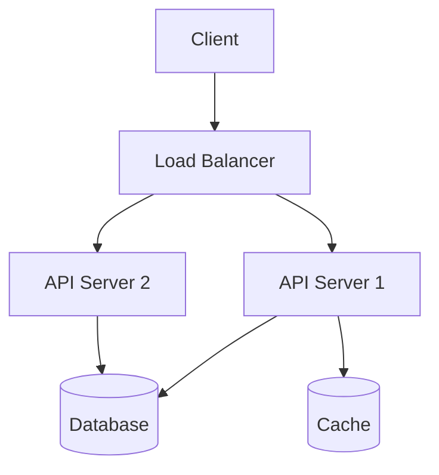
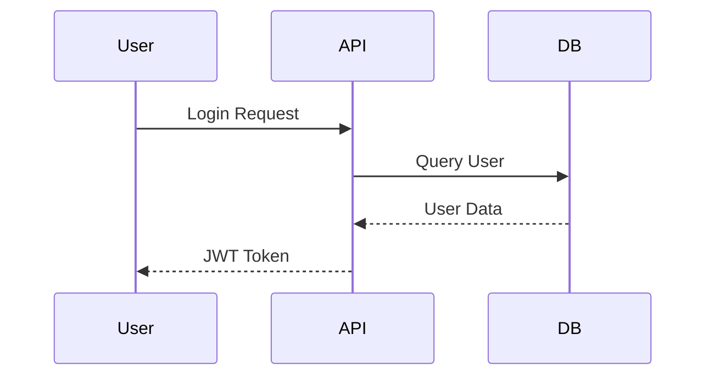
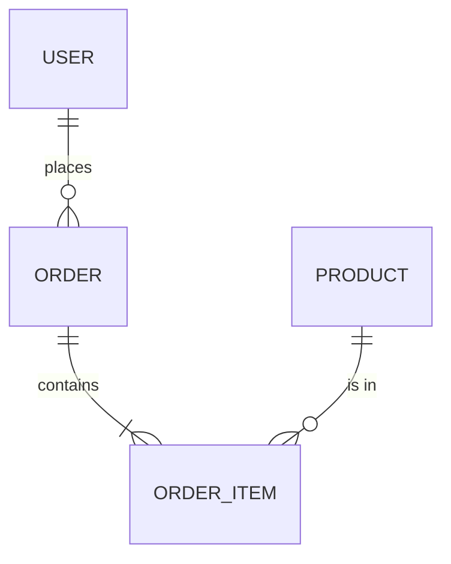
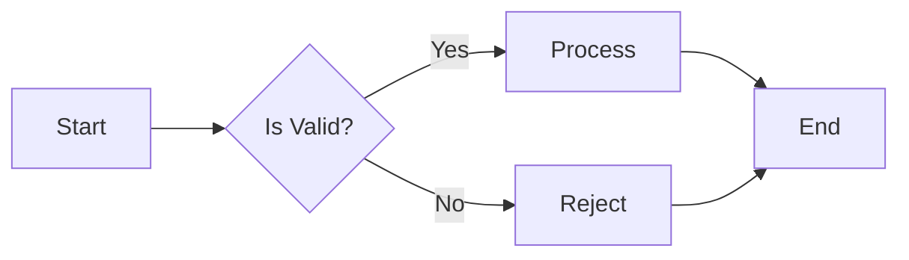

# Mermaid 图表测试

测试 Architect Claw 的 Mermaid 图表生成功能。

## 测试 1：架构图

```mermaid
graph TD
    A[Client] --> B[Load Balancer]
    B --> C[API Server 1]
    B --> D[API Server 2]
    C --> E[(Database)]
    D --> E
    C --> F[(Cache)]
```

## 测试 2：时序图

```mermaid
sequenceDiagram
    participant User
    participant API
    participant DB
    User->>API: Login Request
    API->>DB: Query User
    DB-->>API: User Data
    API-->>User: JWT Token
```

## 测试 3：ER 图

```mermaid
erDiagram
    USER ||--o{ ORDER : places
    ORDER ||--|{ ORDER_ITEM : contains
    PRODUCT ||--o{ ORDER_ITEM : "is in"
```

## 测试 4：流程图

```mermaid
flowchart LR
    A[Start] --> B{Is Valid?}
    B -->|Yes| C[Process]
    B -->|No| D[Reject]
    C --> E[End]
    D --> E
```

---

**测试结论：** ✅ Mermaid 代码格式正确，可以渲染
